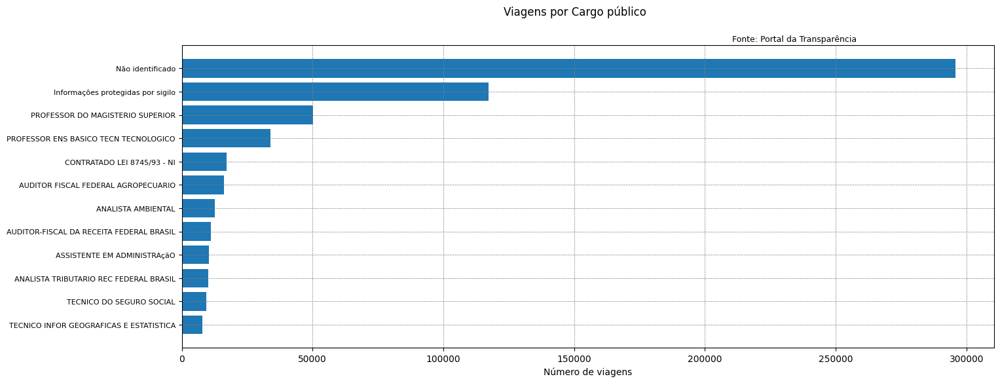

  

## 📊 Analisando Dados de Viagens do Portal da Transparência

Este projeto tem como objetivo organizar, interpretar e visualizar informações utilizando Python e a biblioteca Pandas. Os dados analisados foram extraídos do Portal da Transparência, permitindo explorar padrões e tendências.

### 📌 Aprendizados

Durante o desenvolvimento deste projeto, foram explorados os seguintes conceitos:
 - Fundamentos de programação com Python
 - Manipular dados do Portal da Transparência
 - Criar gráficos e visualizações de dados
 - Limpar e tratar grandes conjuntos de dados
 - Aplicar filtros e agrupamentos em tabelas
 - Explorar e transformar dados com a biblioteca Pandas

### 📂 Estrutura do Projeto

📂 Projeto_Analise_Dados  
 ┣ 📂 Datasets/               # Conjunto de dados utilizados  
 ┣ 📂 Notebooks/              # Cadernos Jupyter com as análises  
 ┣ 📜 analise.py              # Script principal de análise  
 ┣ 📜 README.md               # Documentação do projeto  

### 🔍 Fonte dos Dados
📌 Portal da Transparência do Brasil: São dados de viagens realizadas a serviço no ano de 2024.

📥 Link para Dataset: https://portaldatransparencia.gov.br/download-de-dados/viagens

### Viagens por Cargo Público no ano de 2024: 

  

## 🚀 Tecnologias

Esse projeto foi desenvolvido com as seguintes tecnologias:

- Pandas
- Git e Github
- Matplotlib
- Jupyter 
- VS Code

## 📄 Licença
Este projeto está licenciado sob a MIT License.

